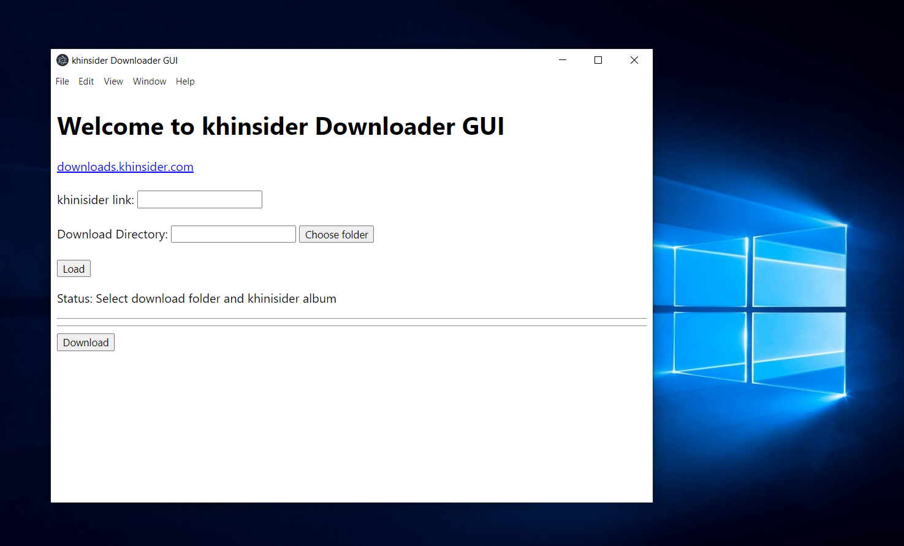

# khinsider Downloader GUI
Wrapper for https://github.com/trash/khinsider-mp3-downloader/pull/9/files written in vanilla Javascript using Electron and [Python-Shell](https://github.com/extrabacon/python-shell).

## Features
- Graphical User Interface (GUI)
- Checkboxes to limit download selection
- Custom download location

## Build
**Requirements:** Python3, NodeJS

**Dependecies:**

Python: bs4

npm: Python-Shell, Electron, Electron-Forge
